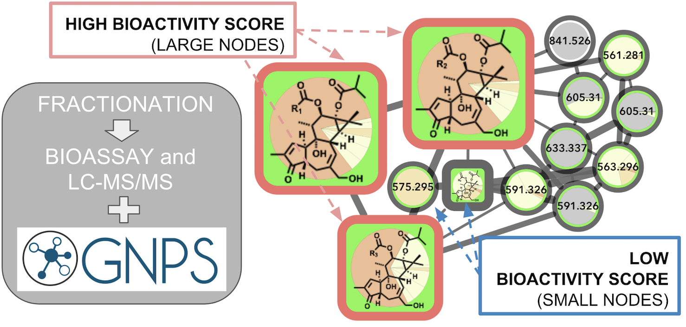

# Bioactive Molecular Networks
The bioactive molecular network workflow integrates MS/MS molecular networking and bioassay-guided fractionation into the concept of bioactive molecular networking. The workflow relies on open bioinformatic tools, such MZmine2 [http://mzmine.github.io/] or Optimus (using OpenMS) [https://github.com/MolecularCartography/Optimus], a Jupyter notebook, and the GNPS web-platform (http://gnps.ucsd.edu).
The code is released as a Jupyter notebook for easiness and reproducibility. The jupyter notebook has been prepared by Dr. Ricardo Silva (UCSD).

## Citation
Bioactivity-Based Molecular Networking for the Discovery of Drug Leads in Natural Product Bioassay-Guided Fractionation. Nothias, L.-F.; Nothias-Esposito, M.; da Silva, R.; Wang, M.; Protsyuk, I.; Zhang, Z.; Sarvepalli, A.; Leyssen, P.; Touboul, D.; Costa, J.; Paolini J., Alexandrov T., Litaudon M., Dorrestein, P.; et al.  J. Nat. Prod. 2018. 
https://pubs.acs.org/doi/10.1021/acs.jnatprod.7b00737

### Graphical abstract

### Table of contents

* [Try online with Binder](#try-online-with-binder)
* [Installation and system requirements](#installation-and-system-requirements)
  * [Install MZmine2 or Optimus](#install-mzmine2-or-optimus)
  * [Jupyter notebook and R](#jupyter-notebook-and-r)
  * [GNPS and Cytoscape](#GNPS)
* [Running the bioactive molecular networking workflow](#running-the-bioactive-molecular-networks-workflow)
  * [The bioactive molecular networking workflow procedure](#the-bioactive-molecular-networking-workflow)
  * [Step 1 - MZmine2 or Optimus LC-MS/MS processing, and bioassay data](#step-1---mzmine2-or-optimus-lc-msms-processing-and-bioassay-data)
  * [Step 2 - Running the Jupyter notebook](#step-2---running-the-jupyter-notebook)
  * [Step 3 - GNPS and Cytoscape](#step-3---gnps-and-cytoscape)
* [Tools employed in the workflow](#tools-employed-in-the-workflow)
* [Help and Troubleshooting](#help-and-troubleshooting)
* [License](#licence)

## Try online with Binder
You can quickly launch the notebooks of this repository using [Binder](https://mybinder.org/) by clicking this badge :

## Installation and system requirements:
### Install MZmine2 or Optimus
- For MZmine2: Download MZmine2 (version 2.31) http://mzmine.github.io/
- For Optimus: Refers to https://github.com/MolecularCartography/Optimus

### Jupyter notebook and R:
The Jupyter Notebook is an open-source web application that allows you to create and share documents that contain live code, equations, visualizations and narrative text. Note that the notebook is available as an R script also.
- For the Jupyter notebook: install Jupyter on http://jupyter.org/ . Note that Anaconda is convenient environment manager:
- This notebook requires R install. First Install R, https://www.r-project.org/ (if needed add the path to your system). Then, as the notebook needs an R kernel in Jupyter notebook, please try to install it. https://github.com/IRkernel/IRkernel
- Download the Jupyter notebook from the GitHub https://github.com/DorresteinLaboratory/Bioactive_Molecular_Networks/
Make sure, the R kernel is selected for the notebook.

### GNPS and Cytoscape:
- You will need to install Cytoscape version 3.4, http://www.cytoscape.org/

## Running the bioactive molecular networking workflow procedure
NB: Template files for each steps are available in the folder TEMPLATE_FILE https://github.com/DorresteinLaboratory/Bioactive_Molecular_Networks/tree/master/TEMPLATE_FILES

### The bioactive molecular networking workflow

### Step 1 - MZmine2 or Optimus LC-MS/MS processing, and bioassay data
#### The step 1 will output:
- a feature table (features_quantification_matrix.csv) that contains the aligned list of features and their intensity accross the fractions analyzed by LC-MS/MS
- a .MGF file containing the MS/MS spectral data
  
#### MZmine2:
Process your data following instructions described in the GNPS data analysis workflow 2.0 (https://bix-lab.ucsd.edu/display/Public/GNPS+data+analysis+workflow+2.0#GNPSdataanalysisworkflow2.0-GNPSdataanalysisworkflow2.0%3AOFFLINEversion). 
Note that two options in the "Peak list row filter" are needed "Keep only features with MS/MS scan (GNPS)", 'Reset the peak number". By default, the bioactive molecular networks Jupyter notebook requires a table exported with the 'Export to CSV' module in MZmine, that includes 'Export row ID', 'Export row m/z', 'Export row retention time', and 'Peak area'. See the template provided. 

#### Optimus: 
Refers to the documentation on https://github.com/MolecularCartography/Optimus
Note that the option 'MS/MS filter' has to be activated. For a video demo on how to use Optimus, see the following video (chapter 1):
https://www.youtube.com/watch?v=zDcY7iuvyQY

#### Add the value of the bioassay experiments for each sample analyzed by LC-MS/MS in the table (features_quantification_matrix.csv to features_quantification_matrix_edited_bioactivity.csv) 
NB: alternatively any other quantitative variable can be used instead (pH, metabolite, concentration, ....)

### Step 2 - Running the Jupyter notebook:
#### The step 2 will calculate the Pearson correlation score and the its significance for every detected features, against the result of the bioassay, and output a table that can imported into Cytoscape:

NB: note that the notebook is available as an R script as well (Bioactive_Molecular_Networks_v1.1_MZmine2.r).

- Upload the Jupyter notebook Bioactive_molecular_networks_v1.0.ipynb in your Jupyter environment.
- Upload your MZmine or Optimus input file (features_quantification_matrix_edited_bioactivity.csv) in the notebook folder. 
- In your Jupyter environment, open the Bioactive_molecular_networks_v1.0.ipynb Jupyter notebook.
- Make sure the R kernel is selected in the notebook.
- In the notebook, specify the path to the input table. If you used an MZmine output table, start at cell 1. If you use an Optimus output table, skip cells 1-3 and start directly at cell 4. 
- Run the Jupyter notebook by clicking in menu Cell/Run All, and wait for the notebook to process (should be less than 30 sec). Informations are provided as comments in each cells.
- Download the output file features_quantification_matrix_transposed_with_significant_correlation_pvalue_corrected.csv

### Step 3 - GNPS and Cytoscape
- Go on Global Natural Product Social Molecular Networking web-platform http://gnps.ucsd.edu
- Run a Data Analysis job following the GNPS data analysis 2.0 workflow. Important: the molecular networks will be generated from the .MGF file export with MZmine2 or Optimus, and MS-Cluster will not be used. See GNPS documentation https://bix-lab.ucsd.edu/display/Public/GNPS+data+analysis+workflow+2.0#GNPSdataanalysisworkflow2.0-GNPSdataanalysisworkflow2.0%3AOFFLINEversion and video tutorials for how to use GNPS https://www.youtube.com/channel/UCufTdDIUPjfoN604Igv_29g/videos
- Import your molecular networks in Cytoscape following GNPS documentation https://bix-lab.ucsd.edu/display/Public/Molecular+Networking+Documentation
- In Cytoscape, import the output table of the Jupyter notebook (features_quantification_matrix_transposed_with_significant_correlation_pvalue_corrected.csv) into your molecular networks.
- In Cytoscape, use the Select function to select the nodes with significant bioactivity (typical threshold would be r2 > 0.8 and p-value < -0.02).
- In Cytoscape, bypass the style of these nodes as needed (the node size or node shape can be used to visualize). Piechart diagrams can be used to display the distribution of an ion accross samples.

#### Figure from the manuscript Nothias et al 2018

## Tools employed in the workflow
GNPS: Wang, M.; Carver, J. J.; Phelan, V. V.; Sanchez, L. M.; Garg, N.; Peng, Y.; Nguyen, D. D.; Watrous, J.; Kapono, C. A.; Luzzatto-Knaan, T.; et al. Sharing and Community Curation of Mass Spectrometry Data with Global Natural Products Social Molecular Networking. Nat. Biotechnol. 2016, 34 (8), 828–837. https://www.nature.com/articles/nbt.3597

MZmine: Pluskal, T.; Castillo, S.; Villar-Briones, A.; Oresic, M. MZmine 2: Modular Framework for Processing, Visualizing, and Analyzing Mass Spectrometry-Based Molecular Profile Data. BMC Bioinformatics 2010, 11, 395. https://bmcbioinformatics.biomedcentral.com/articles/10.1186/1471-2105-11-395

OpenMS: Röst, H. L.; Sachsenberg, T.; Aiche, S.; Bielow, C.; Weisser, H.; Aicheler, F.; Andreotti, S.; Ehrlich, H.-C.; Gutenbrunner, P.; Kenar, E.; et al. OpenMS: A Flexible Open-Source Software Platform for Mass Spectrometry Data Analysis. Nat. Methods 2016, 13 (9), 741–748. https://www.nature.com/articles/nmeth.3959

Optimus: Protsyuk, I.; Melnik, A. V.; Nothias, L.-F.; Rappez, L.; Phapale, P.; Aksenov, A. A.; Bouslimani, A.; Ryazanov, S.; Dorrestein, P. C.; Alexandrov, T. 3D Molecular Cartography Using LC-MS Facilitated by Optimus and ’Ili Software. Nat. Protoc. 2018, 13 (1), 134–154. https://www.nature.com/articles/nprot.2017.122

Cytoscape: Shannon, P.; Markiel, A.; Ozier, O.; Baliga, N. S.; Wang, J. T.; Ramage, D.; Amin, N.; Schwikowski, B.; Ideker, T. Cytoscape: A Software Environment for Integrated Models of Biomolecular Interaction Networks. Genome Res. 2003, 13 (11), 2498–2504. https://www.ncbi.nlm.nih.gov/pubmed/14597658

## Help and Troubleshooting
- Jupyter notebook: there are multiple online ressources and videos available to present the functionality of Jupyter notebooks. Such as: https://www.youtube.com/watch?v=jZ952vChhuI&t=210s
- If there is an error, make sure your input file are similar to the template files provided on GitHub.
https://github.com/DorresteinLaboratory/Bioactive_Molecular_Networks/tree/master/TEMPLATE_FILES
- Rerun the workflow. Try eventually with a template file provided to verify that the notebook is not corrupted.
- If there is still an error, download a fresh notebook and retry.
- If an error is still showing up. Please raise an issue in GitHub and we will look into this.

## Licence
The Jupyter notebooks available on this GitHub are available under the MIT Open licence.
https://github.com/DorresteinLaboratory/Bioactive_Molecular_Networks/blob/master/LICENSE.md

